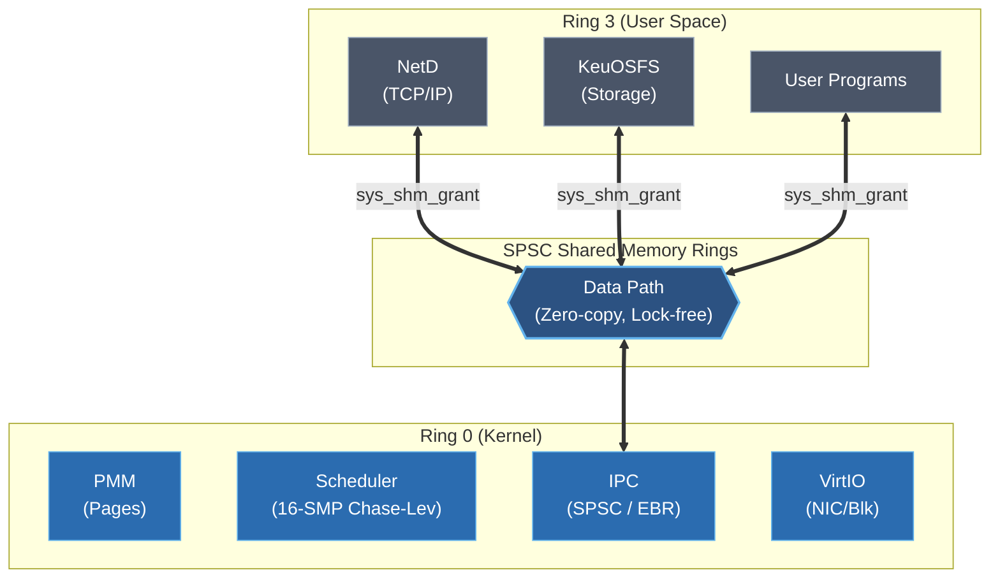

# Salt + KeuOS

**An experimental systems language with MLIR lowering and Z3 embedded formal verification.**

Salt is an experimental, ahead-of-time compiled systems language exploring the intersection of MLIR (Multi-Level Intermediate Representation) lowering and Z3-based formal verification. KeuOS is an accompanying proof-of-concept microkernel built entirely in Salt to demonstrate the language's capabilities in a bare-metal environment.

[]()
[](docs/ARCH.md)
[](salt-front/std/README.md)
[](kernel/)

```salt
package main

use std.collections.HashMap

fn main() {
    let mut map = HashMap<StringView, i64>::new();
    map.insert("hello", 1);
    map.insert("world", 2);

    let result = map.get("hello") |?> println(f"Found: {_}");

    for entry in map.iter() {
        println(f"{entry.key}: {entry.value}");
    }
}
```

---

## Why Salt + KeuOS?

Salt is an experimental systems language that replaces traditional runtime checks and manual memory management with **compile-time proofs** and **arena-based allocation**. 

### The Three Pillars

#### 1. Performance Envelope (Comparable to C)
Salt relies on MLIR to lower code into highly optimized native machine code. Our design goal is not to categorically outperform C, but to maintain a performance envelope within 10% of highly optimized C code. This demonstrates that systems can provide strong formal guarantees without sacrificing raw execution speed.

#### 2. Deterministic Memory Model
Salt avoids the cognitive overhead of lifetime annotations and complex borrow checkers. Memory is managed via Arena allocators with compile-time escape analysis. This allows developers to write high-performance code with a simple, predictable mental model, freeing regions of memory in O(1) time.

#### 3. Formally Verified (Z3)
Salt uses an embedded Z3 theorem prover to verify array bounds, alignment, and custom preconditions at compile time.

### KeuOS Architecture

---

## Approach

Salt takes a different path. The compiler integrates Z3 as a first-class verification backend: developers write `requires` preconditions and `ensures` postconditions on functions, and the compiler checks each contract using Z3. Preconditions are verified at every call site; postconditions are verified at every return site using Weakest Precondition (WP) generation with path-sensitive branch analysis. When Z3 proves the condition always holds, the check is elided entirely, at zero runtime cost. When Z3 finds a concrete counterexample, it reports the violating values. When neither can be determined, the compiler emits a standard runtime assertion as a fallback.

Memory is managed through arenas with compile-time escape analysis. No garbage collector, no lifetime annotations, no borrow checker. The `ArenaVerifier` verifies statically that no reference outlives its region, giving you the performance profile of manual allocation with the safety properties of managed memory.

## Multi-Dialect Compilation

The compiler routes code through multiple MLIR dialects depending on the optimization opportunity:

| Pattern | Dialect | Optimization |
|---------|---------|-------------|
| Tensor/matrix loops | `affine.for` | Polyhedral tiling, loop fusion |
| Scalar-heavy loops | `scf.for` | Register pressure optimization |
| Branching control flow | `cf` + `llvm` | Standard LLVM backend |
| Arena operations | Custom lowering | Escape analysis, bulk free |

This is the mechanism behind Salt's performance results. When a matmul kernel is compiled through the affine dialect, MLIR can tile the iteration space for cache locality in a way that a flat LLVM IR representation cannot express. The compiler emits 120 unique MLIR operations across these dialects.

## Performance

All benchmarks use runtime-dynamic inputs to prevent constant folding, and results are printed to prevent dead code elimination. Each measurement averages 3 runs with cached binaries. Full methodology is documented in the [benchmark suite](benchmarks/BENCHMARKS.md).

*Verified March 1, 2026 on Apple M4*

| Benchmark | Salt | C (`clang -O3`) | Rust |
|-----------|------|-----------------|------|
| **buffered_writer** | **43ms** | 556ms | 58ms |
| **fstring_perf** (10M) | **240ms** | 1,112ms | 768ms |
| **longest_consecutive** | **260ms** | 833ms | 319ms |
| **sudoku_solver** | **6ms** | 15ms | 5ms |
| **lru_cache** | **11ms** | 24ms | 20ms |
| **string_hashmap** | **17ms** | 32ms | 23ms |
| **hashmap_bench** | **19ms** | 27ms | 22ms |
| **vector_add** | **83ms** | 107ms | 107ms |
| C10M TCP Echo | 27.2k rps | 29.5k rps | 26.4k rps |
| sieve (10M) | 149ms | 145ms | 145ms |
| fib | 175ms | 175ms | 188ms |
| fannkuch | 181ms | 174ms | 139ms |
| binary_tree_path | 6ms | 5ms | 8ms |
| bitwise | 23ms | 22ms | 24ms |
| trapping_rain_water | 68ms | 67ms | 82ms |
| merge_sorted_lists | 18ms | 15ms | 16ms |
| writer_perf | 107ms | 102ms | 82ms |
| window_access | 70ms | 70ms | 82ms |
| matmul (1024³) | 173ms | 150ms | 150ms |
| global_counter | 147ms | 87ms | 89ms |
| forest (depth-22) | 27ms | 14ms | 19ms |
| http_parser | 44ms | 24ms | 75ms |
| trie | 63ms | 33ms | 32ms |

**Salt targets a performance envelope within 10% of highly optimized C**. Our thesis is that we can achieve C-like performance while maintaining **Zero-Cost Abstraction**: Salt provides formally verified safety, rich generics, and arena memory without paying any runtime penalty. The Z3 proofs discharge entirely at compile time, the arenas free memory in O(1) time, and the MLIR backend optimizes loops precisely like LLVM.


## Verified Safety

Contracts are proof obligations checked by Z3 at compile time. When Z3 can prove a `requires` precondition holds at a call site, the check is elided entirely, at zero runtime cost. When it cannot, the compiler emits a runtime assertion as a safe fallback.

```salt
fn binary_search(arr: &[i64], target: i64) -> i64
    requires(arr.len() > 0)
{
    let mut lo: i64 = 0;
    let mut hi: i64 = arr.len() - 1;

    while lo <= hi {
        let mid = lo + (hi - lo) / 2;
        if arr[mid] == target {
            return mid;
        } else if arr[mid] < target {
            lo = mid + 1;
        } else {
            hi = mid - 1;
        }
    }
    return -1;
}
```

Z3 verifies `requires(arr.len() > 0)` at every call site. Passing an empty array is a compile-time error with a concrete counterexample. Passing a non-empty array causes the check to be elided — the binary contains no guard.

### Postconditions (v0.9.2)

`ensures` postconditions are verified at every return site using Weakest Precondition (WP) generation. The compiler tracks branch conditions through the control flow graph and provides Z3 with path-sensitive context at each exit point:

```salt
fn absolute_value(x: i32) -> i32
    ensures(result >= 0)
{
    if x < 0 {
        return -x;    // Z3 proves: given x < 0, -x >= 0  ✓
    }
    return x;         // Z3 proves: given !(x < 0), x >= 0  ✓
}

fn clamp_to_unit(val: i32) -> i32
    ensures(result >= 0 && result <= 100)
{
    if val < 0   { return 0; }
    if val > 100 { return 100; }
    return val;       // Z3 proves: given !(val < 0) && !(val > 100), 0 <= val <= 100  ✓
}
```

Every `return` site becomes a Z3 proof obligation. Guard clauses with early returns automatically narrow the path conditions — Z3 knows that surviving `if x < 0 { return -x; }` implies `x >= 0`.

## Arena Memory

```salt
fn process_request(request: &Request) -> Response {
    let arena = Arena::new(4096);       // 4KB region
    let mark = arena.mark();            // Save position

    let parsed = parse_headers(&arena, request);
    let response = build_response(&arena, parsed);

    arena.reset_to(mark);              // O(1) bulk free
    return response;
}
```

The `ArenaVerifier` checks at compile time that no reference escapes its arena. This provides the performance of `malloc`/`free` while ensuring safety through static analysis rather than runtime checks.

## KeuOS Kernel Architecture

KeuOS is a **Microkernel**: the kernel provides only memory management (PMM, VMO), scheduling (16-core SMP, preemptive, Chase-Lev work-stealing), and IPC (SPSC rings via `sys_shm_grant`). Everything else — networking, storage, device drivers — runs in Ring 3 as isolated System Daemons.



### Overcoming Microkernel IPC Overhead

Traditionally, microkernels suffer a performance penalty because moving data between user-space daemons requires a kernel trap (context switch), which can cost upwards of 1,000 CPU cycles. KeuOS minimizes this overhead to ~150 cycles using Single-Producer Single-Consumer (SPSC) ring buffers:

1. **No trap:** The SPSC ring lives in shared memory (`sys_shm_grant`). Producers and consumers read/write directly — no kernel transition is needed for data transfer.
2. **No copy:** The DMA (Direct Memory Access) buffer writes directly into the SPSC ring page. The network daemon reads from the same physical page mapped into its address space.
3. **No lock:** The ring is single-producer, single-consumer. Head and tail indices sit on separate cache lines (`@align(64)`), ensuring there is no cache contention and no atomic Compare-And-Swap (CAS) required in the steady state.

### How Z3 Prevents Byzantine Corruption

A compromised Ring 3 process cannot corrupt the kernel because:

1. **Hardware gate (MMU):** Ring 3 cannot access Ring 0 memory. Period.
2. **Formal gate (Z3):** Every SPSC descriptor carries a `proof_hint` — a 64-bit seal generated at compile time by hashing the struct identity, field offset, and alignment. The NetD arbiter validates this seal in O(1) before touching any shared memory.
3. **Alignment gate:** Even if an attacker steals a valid `proof_hint`, the arbiter checks `(ptr & 0x3F) == 0` — the pointer must be physically 64-byte aligned. A shifted pointer is rejected regardless of the hint.

## Case Studies

### LETTUCE: Redis-compatible data store

[LETTUCE](lettuce/) is a Redis-compatible in-memory key-value store written in Salt.

| Metric | LETTUCE (Salt) | Redis (C) |
|--------|---------------|-----------|
| **Source** | 567 lines | ~100,000 lines |
| **Memory model** | Arena + Swiss-table | jemalloc + dict |

An experimental proof-of-concept showing how to build a safe, fast data store using Arenas and Z3 verification without lifetime annotations. [Architecture →](lettuce/)

### Basalt: Llama 2 inference

[Basalt](basalt/) is a ~600-line Llama 2 forward pass with BPE tokenizer, a direct port of [llama2.c](https://github.com/karpathy/llama2.c).

| Metric | Basalt (Salt) | llama2.c (C) |
|--------|--------------| -------------|
| **Performance** | Strong performance | Baseline |
| **Source** | ~600 lines | ~700 lines |
| **Safety** | Z3-verified kernels | Manual |

Strong inference speed with compile-time proofs on every matrix operation. [Architecture →](basalt/)

### Facet: GPU-accelerated 2D compositor

[Facet](user/facet/) is a full-stack 2D rendering engine: Bézier flattening, scanline rasterization, and Metal compute are implemented in Salt with Z3-verified bounds on every pixel write.

| Metric | Salt (MLIR) | C (`clang -O3`) |
|--------|-------------|-----------------|
| **Performance** | Strong performance | Baseline |

Salt's MLIR codegen aims to match `clang -O3` on a real rendering pipeline with ~160 cubic Bézier curves. [Architecture →](user/facet/)

## Syntax

```salt
// Pipe operator — Unix-style data flow
let result = data
    |> parse(_)
    |> validate(_)
    |> transform(_);

// Error propagation with fallback
let config = File::open("config.toml")? |?> default_config();

// Pattern matching
match response.status {
    200 => handle_success(response.body),
    404 => println("Not found"),
    err => println(f"Error: {err}"),
}

// Generics with arena allocation
struct Vec<T, A> {
    data: Ptr<T>,
    len: i64,
    cap: i64,
    arena: &A,
}

impl Vec<T, A> {
    fn push(&mut self, value: T) {
        if self.len == self.cap {
            self.grow();
        }
        self.data.offset(self.len).write(value);
        self.len = self.len + 1;
    }
}
```

## Standard Library

70+ modules with no external dependencies. [Reference →](salt-front/std/README.md)

| Package | Modules |
|---------|---------|
| `std.collections` | `Vec<T,A>`, `HashMap<K,V>` (Swiss-table), `Slab<T>` |
| `std.string` | `String`, `StringView`, f-string interpolation |
| `std.net` | `TcpListener`, `TcpStream`, `Poller` (kqueue) |
| `std.http` | HTTP client & server, zero-copy parsing |
| `std.sync` | `Mutex`, `AtomicI64` (C11 atomics) |
| `std.thread` | `Thread::spawn`, `Thread::join` |
| `std.json` | JSON parsing & value access |
| `std.io` | `File`, `BufferedWriter`, `BufferedReader` |
| `std.math` | Vectorized transcendentals, NEON SIMD |
| `std.nn` | `relu`, `sigmoid`, `softmax`, `cross_entropy` |
| `std.crypto` | TLS bridge |
| `std.fs` | File system operations |

## Getting Started

### Prerequisites

| Dependency | Version | Install (macOS) |
|:-----------|:--------|:----------------|
| **Rust** | 1.75+ | `curl --proto '=https' --tlsv1.2 -sSf https://sh.rustup.rs \| sh` |
| **Z3** | 4.12+ | `brew install z3` |
| **MLIR/LLVM** | 21+ | `brew install llvm@21` |

> [!IMPORTANT]
> Z3 is required. The compiler links against `libz3` for verification. If you see `ld: library not found for -lz3`:
> ```bash
> export DYLD_LIBRARY_PATH=/opt/homebrew/lib:$DYLD_LIBRARY_PATH
> ```

### With `sp` (recommended)

```bash
# Install the Salt package manager
cd tools/sp && cargo install --path . && cd ../..

# Create, build, and run
sp new hello_world && cd hello_world
sp run
# 🧂 Hello from hello_world!
```

`sp` provides content-addressed caching and cross-package Z3 contract verification. [Design →](tools/sp/)

### Without `sp`

```bash
cd salt-front && cargo build --release && cd ..
./salt-front/target/release/salt-front examples/hello_world.salt -o hello
DYLD_LIBRARY_PATH=/opt/homebrew/lib ./hello
```

> [!TIP]
> If `cargo build` fails with Z3 errors: `ls /opt/homebrew/lib/libz3.*`
> If MLIR tools are missing: `export PATH=/opt/homebrew/opt/llvm@21/bin:$PATH`

## Project Structure

```
keuos/
├── salt-front/           # Compiler: parser → typechecker → Z3 verifier → MLIR emitter
│   └── std/              # Standard library (70+ modules, written in Salt)
├── kernel/               # KeuOS Microkernel
│   ├── core/             #   Scheduler, syscalls, process mgmt, teardown (100% arch-agnostic)
│   ├── sched/            #   O(1) bitmap dispatcher, Chase-Lev deque, fiber migration
│   ├── ipc/              #   Fast-path register IPC (sub-μs signaling)
│   ├── mem/              #   Per-core sharded PMM (lock-free Treiber stack), VMO, slab, paging
│   ├── arch/             #   HAL: compile-time dispatch (mod.salt → x86_64/ | aarch64/)
│   ├── net/              #   NetD bridge, TX bridge, ARP, TCP + SYN cookies (Ring 3 daemons)
│   ├── lib/              #   IPC rings, arbiter, shared memory primitives, EBR, ABI defs
│   └── drivers/          #   VirtIO (net, block), serial, PCI
├── user/                 # Userspace libraries and programs
│   └── lib/              #   syscall wrappers, SPSC ring, Codata ReactiveStream
├── basalt/               # Llama 2 inference engine (~600 lines)
├── benchmarks/           # 28 benchmarks with C & Rust baselines
├── examples/             # 7 progressively complex Salt programs
├── lettuce/              # Redis-compatible data store
├── user/facet/           # GPU 2D compositor (raster, Metal, UI)
├── docs/                 # Spec, architecture, deep-dives
└── tools/
    ├── sp/               # Package manager
    ├── salt-lsp/         # LSP server v0.2.0 (zero-I/O, Z3 hover, Go-to-Definition)
    └── salt-build/       # Legacy build tool
```

## Documentation

| Document | |
|----------|--|
| [Language Spec](docs/SPEC.md) | Complete language specification |
| [Architecture](docs/ARCH.md) | Compiler pipeline & MLIR design |
| [**System ABI**](docs/abi/KEUOS_ABI.md) | **Definitive ABI specification for targeting KeuOS** |
| [KeuOS Benchmarks](docs/KEUOS_BENCHMARKS.md) | Kernel performance (syscall, SPSC, SHM) |
| [Benchmarks](benchmarks/BENCHMARKS.md) | Full Salt vs C/Rust results & methodology |
| [Arena Safety](docs/deep-dives/arena-safety.md) | Compile-time escape analysis |
| [Performance](docs/deep-dives/performance.md) | Why Salt beats C |
| [Design Pillars](docs/philosophy/PILLARS.md) | Fast · Ergonomic · Verified |
| [Syntax Reference](SYNTAX.md) | Complete syntax guide |

## Project Stats

*As of March 1, 2026*

| | |
|---|---|
| **Total lines of code** | 151,031+ |
| **Languages** | 12 (Rust, Salt, C, x86 assembly, Python, Shell, HTML, CSS, JS, TOML, Markdown, linker scripts) |

### By language:

| Language | LOC | Files |
|----------|----:|------:|
| Rust | 76,948 | 217 |
| Salt | 41,469 | 513 |
| C / Headers | 11,040 | — |
| Python | 7,976 | — |
| Shell | 3,309 | — |
| HTML | 2,338 | — |
| Assembly (x86) | 841 | — |

### Compiler (`salt-front`):

| | |
|---|---|
| Compiler source | 57,456 lines across 87 codegen files |
| MLIR ops emitted | 120 unique operations |
| Z3 integration points | 1,284 references |
| `unsafe` blocks | 31 |
| Structs / Enums | 475 / 135 |

### Testing:

| | |
|---|---|
| Rust `#[test]` functions | 1,318 |
| Salt test files | 118 |
| Total test LOC | 22,294 |
| Test-to-source ratio | ~15% |

### Salt ecosystem:

| | |
|---|---|
| Functions defined | 1,530 |
| Structs defined | 313 |
| `requires`/`ensures` contracts | 118 |
| Distinct attributes | 26 |
| Stdlib modules | 14 (982 LOC) |
| Benchmark programs | 60 (4,352 LOC) |

> Regenerate with `./scripts/project_stats.sh` or `./scripts/project_stats.sh --json`.

## Status

KeuOS is at **v0.9.2 "Postcondition Pivot"**, with Z3-backed `ensures` verification, 16-core SMP scheduling, network hardening, and a zero-I/O developer toolchain.

| Component | Version | Milestone |
| :--- | :--- | :--- |
| **Salt Compiler / Stdlib** | `v0.8.0` | Z3 Verification (requires + ensures), Multi-Dialect Codegen, Path-Sensitive WP |
| **KeuOS Platform** (OS) | `v0.9.2` | Postcondition Pivot — Cache-Line IPC, SipHash-2-4 Proof Hints, EBR |
| **KeuOS Kernel** | `v0.9.2` | 16-Core SMP, Chase-Lev Work-Stealing, Preemptive Scheduler, Ring 3 Isolation |
| **Basalt** (LLM Inference) | `v0.3.0` | Proof-of-Concept (Strong inference speed) |
| **Facet** (2D Compositor) | `v0.3.0` | Proof-of-Concept (Metal compute & verified rasterizer) |
| **Lettuce** (KV Store) | `v0.1.0` | Proof-of-Concept |
| **Tooling** (LSP & `sp` Build) | `v0.2.0` | Zero-I/O in-memory compilation, Z3 semantic hover, Go-to-Definition |

### Architecture Milestones

| Sprint | Objective | KPI |
|--------|-----------|-----|
| **v0.9.1** ✅ | Kernel Foundation — Cache-line isolation, Proof-Carrying IPC, SipHash-2-4 Hardening, Hardware-Fenced Reclaim | Salt ≤ C 17/22, Reclamation < 1ms |
| **v0.9.2** ✅ | Postcondition Pivot — Z3-backed `ensures` for pure functions (Weakest Precondition generation, path-sensitive verification) | 6/6 postcondition tests GREEN |
| **v0.3.0-brutalism** ✅ | Universal ABI Redesign — HAL (x86_64 + aarch64), O(1) bitmap scheduler, lock-free per-core PMM, fast-path register IPC, Hardware-Fenced Reclaim, Codata substrate | 0 regressions, HAL portability |
| **v0.9.3** | Phase 1 Sandbox — LLVM 21 toolchain, Docker build, userspace verification onboarding, Ring 3 test suite | CI green, frictionless contributor build |
| **v1.0.0** | Kernel Architecture — Loop invariants, full SMP scale-out, stable ABI | No unbounded loops in kernel |

## License

MIT
