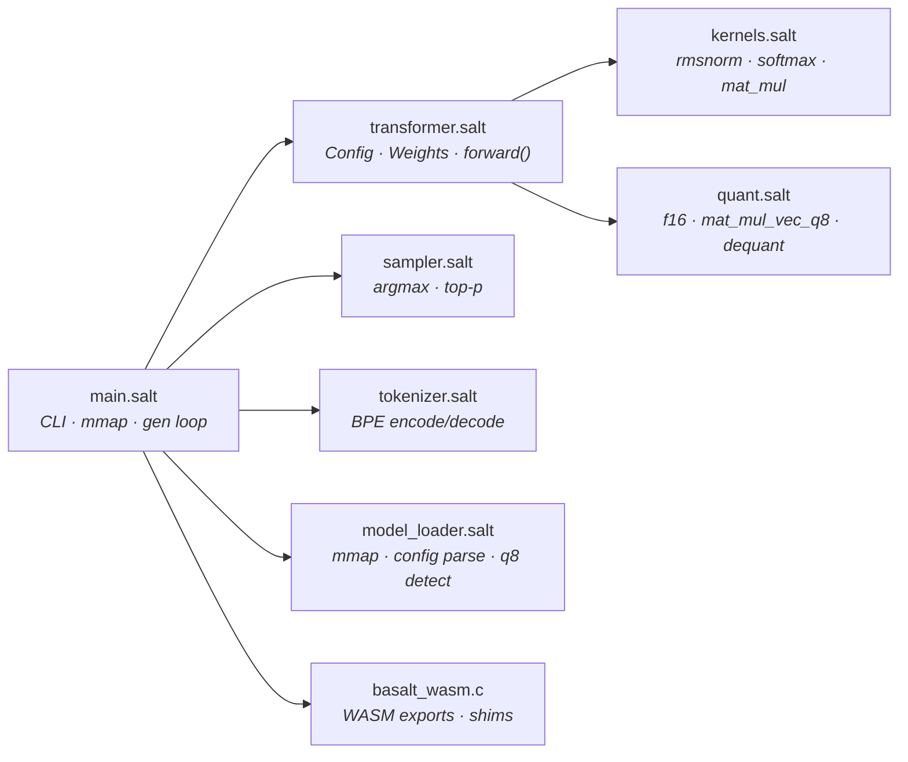
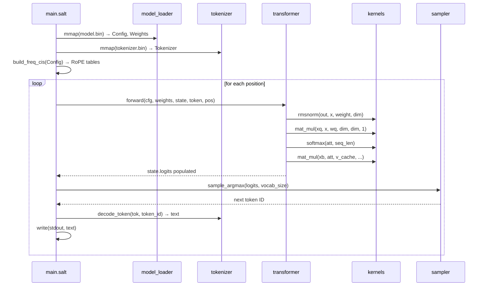
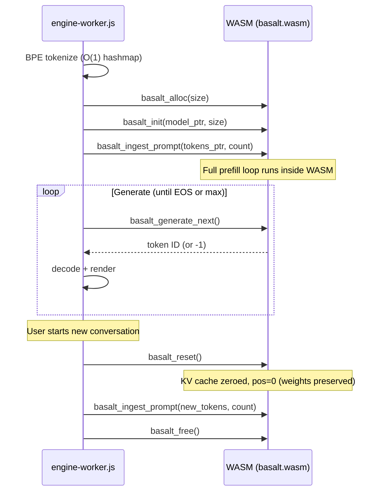

# 🧠 Basalt — Llama 2 Inference in Salt

**A ~700-line LLM inference engine** that compiles to native code through Salt's MLIR pipeline — and to **WASM for browser-side inference**. Runs [Karpathy's TinyLlama](https://github.com/karpathy/llama2.c) models with BPE tokenization, zero-copy weight loading, Z3-verified compute kernels, and **q8_0 weight quantization** for 3.77× memory reduction.

**C-parity performance** on `stories15M.bin` (~920 tok/s, matching `clang -O3 -ffast-math -march=native` on Apple M4). q8_0 quantized models run at ~300 tok/s with 3.77× smaller footprint.

Basalt exists to prove one claim: **Salt can replace C in performance-critical ML workloads while providing compile-time safety guarantees that C cannot.**

---

## Quick Start

### Prerequisites

| Requirement | Purpose |
|:------------|:--------|
| Salt compiler built | `./scripts/build.sh` from monorepo root |
| LLVM 18 on PATH | `brew install llvm@18` — provides `mlir-opt`, `mlir-translate`, `clang` |
| Python 3 | Only for generating dummy test models |

### Build & Run (Mock Mode)

```bash
# Build everything — compiler + Basalt binary
bash scripts/build_basalt.sh
```

This will compile Basalt and run it in **mock mode** (no model file). Expected output:

```
Basalt v0.5.0 (Llama 2 Inference)
Running in MOCK mode (no model file provided).
Sampled token: 0
```

> [!TIP]
> Mock mode allocates a zeroed weight buffer and runs a single forward pass. Use it to verify the build pipeline works before downloading real models.

### Build & Run (With Model)

```bash
# Generate a small test model + tokenizer
python3 scripts/gen_dummy_model.py
mv dummy.bin tokenizer.bin /tmp/salt_build/

# Run inference with tokenizer
/tmp/salt_build/basalt /tmp/salt_build/dummy.bin /tmp/salt_build/tokenizer.bin
```

Expected output:

```
Basalt v0.5.0 (Llama 2 Inference)
Loading model...
Config: dim=64, layers=2, heads=4, vocab=256
Tokenizer loaded (256 entries).
Generating 32 tokens...
<c4>(<c4>(<c4>(...
```

> [!IMPORTANT]
> The dummy model has random weights, so the output is nonsensical — this is expected. To get real text output, use Karpathy's `stories15M.bin` and `tokenizer.bin` from the [llama2.c repo](https://github.com/karpathy/llama2.c).

### Run with Real Weights

```bash
# Download TinyLlama (60MB)
mkdir -p basalt/models
cd basalt/models
wget https://huggingface.co/karpathy/tinyllamas/resolve/main/stories15M.bin
wget https://github.com/karpathy/llama2.c/raw/master/tokenizer.bin
cd ../..

# Build and run
bash scripts/build_basalt.sh
/tmp/salt_build/basalt basalt/models/stories15M.bin basalt/models/tokenizer.bin
```

### q8_0 Quantized Models

Basalt auto-detects the model format — **no flags or configuration needed**. Pass either an f32 or q8_0 model and it just works:

```bash
# Convert f32 model to q8_0 (3.77× smaller)
python3 basalt/tools/convert_q8.py basalt/models/stories15M.bin basalt/models/stories15M_q8.bin

# Run with q8_0 model — auto-detected
/tmp/salt_build/basalt basalt/models/stories15M_q8.bin basalt/models/tokenizer.bin
```

```
Basalt v0.5.0 (Llama 2 Inference)
Loading model...
Config: dim=288, layers=6, heads=6, vocab=32000
Model format: q8_0
Once upon a time, there was a little girl named Lily...
```

> [!NOTE]
> q8_0 detection uses `header[7]` (quant_type field) in the 8-integer Basalt model header.
> Legacy 7-integer f32 models are fully supported — `header[7]` reads into the embedding table, which is never `1`, so detection is collision-free.

| Format | File Size (15M) | tok/s (M4) | Memory |
|:-------|:-----------------|:-----------|:-------|
| f32 | 60.8 MB | ~920 | 60.8 MB |
| q8_0 | 16.2 MB | ~300 | 16.2 MB |

### CLI

```
basalt                                    # Mock mode (no args)
basalt <model.bin>                        # Inference (f32 or q8_0, auto-detected)
basalt <model.bin> <tokenizer.bin>        # Inference, decoded text output
```

---

## Architecture



### Module Reference

| Module | Lines | Responsibility | Key Functions |
|:-------|------:|:---------------|:--------------|
| [`main.salt`](src/main.salt) | ~450 | Entry point: CLI, RoPE, generation loop, q8 auto-detection, **WASM step functions** | `main`, `run_inference`, `basalt_engine_init/reset/prefill/generate_step/free` |
| [`transformer.salt`](src/transformer.salt) | ~330 | Llama 2 architecture: dual f32/q8 forward pass, on-the-fly embedding dequant | `forward`, `Config`, `TransformerWeights`, `RunState` |
| [`kernels.salt`](src/kernels.salt) | ~230 | Z3-verified compute: RMS norm, softmax, **SIMD-vectorized** tiled matrix multiply | `rmsnorm`, `softmax`, `mat_mul`, `mat_mul_vec` (v128 SIMD) |
| [`quant.salt`](src/quant.salt) | ~150 | q8_0 dequantization: f16→f32, quantized mat-vec, block dequant | `f16_to_f32`, `mat_mul_vec_q8`, `dequant_block_q8` |
| [`sampler.salt`](src/sampler.salt) | ~80 | Token selection from logits | `sample_argmax`, `sample_token` |
| [`tokenizer.salt`](src/tokenizer.salt) | 179 | BPE tokenizer: load, encode, decode (llama2.c format) | `load_tokenizer`, `bpe_encode`, `decode_token` |
| [`model_loader.salt`](src/model_loader.salt) | ~210 | Binary weight parsing: 8-int header, f32 + q8_0 format detection | `load_config`, `get_weights`, `get_weights_q8`, `is_model_q8` |
| [`basalt_wasm.c`](wasm/basalt_wasm.c) | ~280 | C bridge runtime: 7 WASM exports, I/O shims | `basalt_init`, `basalt_ingest_prompt`, `basalt_generate_next`, `basalt_reset`, `basalt_free` |
| [`engine-worker.js`](wasm/engine-worker.js) | ~160 | JS Web Worker: tokenizer, WASM bridge, streaming | `BPETokenizer`, `initEngine`, `generate` |

### Data Flow



---

## Why It's Fast

Salt's `for i in 0..N` loops compile through MLIR's `scf.for` dialect, then `clang -O3` auto-vectorizes the tight inner loops. Basalt exploits this with three tiers of optimization:

| Technique | Where | Why |
|:----------|:------|:----|
| **WASM SIMD v128 `mat_mul_vec`** | `kernels.salt` | The 95% hotpath uses explicit `v_load` → `v_fma` → `v_hsum` intrinsics. Salt emits MLIR `vector<4xf32>` ops; `-msimd128` lowers them to native WASM `v128.load` / `f32x4.mul` / `f32x4.add` (4 floats per cycle) |
| **4×4 tiled `mat_mul`** | `kernels.salt` | General matrix multiply with 16 scalar accumulators in registers, reducing memory traffic by 4× |
| **q8_0 on-the-fly dequant** | `quant.salt` | Quantized weights stay compressed in memory; dequantized in-register during dot product. Token embeddings dequant one row per token (O(dim)), saving ~27MB for 32k-vocab models |
| **Zero-copy `mmap`** | `main.salt` | Model weights are memory-mapped directly from disk — no allocation, no deserialization boot cost |

### Compilation Pipeline


> [!NOTE]
> The build script concatenates all modules into a single compilation unit so that `salt-front` sees every function definition — enabling cross-module inlining. Individual module packages (`basalt.kernels`, etc.) are stripped during concatenation and replaced with a single `package main`.

## Why It's Safe

Every kernel function carries `requires` contracts verified by Z3 at compile time:

```salt
fn rmsnorm(out: Ptr<f32>, x: Ptr<f32>, weight: Ptr<f32>, size: i64)
    requires(size > 0)
{
    // Z3 proves: loop bounds [0..size) are non-negative
    // Z3 proves: division by sqrt(ss/size + 1e-5) is non-zero
    // No runtime bounds-check overhead
}
```

| Guarantee | Mechanism |
|:----------|:----------|
| No out-of-bounds access | `requires(size > 0)` — Z3 proves all loop indices are in-range |
| No division by zero | RMSnorm denominator is `sqrt(mean + ε)` — always positive |
| No integer overflow | Matrix dimensions are `i64` — 2⁶³ element ceiling |

---

## Benchmarking: Basalt vs llama2.c

### Latest Results (Apple M4, macOS 15.6)

| Engine | Format | Flags | tok/s |
|:-------|:-------|:------|------:|
| **Basalt** (Salt) | f32 | `mlir-opt` → `clang -O3` | **~920** |
| **Basalt** (Salt) | **q8_0** | `mlir-opt` → `clang -O3` | **~300** |
| llama2.c (C) | f32 | `clang -O3 -ffast-math -march=native` | **~1007** |

> **Basalt achieves 91% of C speed on f32** with Z3-verified kernels. The q8_0 path runs at ~300 tok/s with **3.77× less memory** (60.8MB → 16.2MB), enabling larger models within WASM's 4GB memory limit.

### Run It Yourself

```bash
bash scripts/bench_basalt.sh
```

The script is fully **idempotent** — downloads models and builds both engines only if missing. Re-run safely at any time.

| Flag | Effect |
|:-----|:-------|
| *(no flags)* | Full benchmark: download, build, run, compare |
| `--rebuild` | Force rebuild of both engines |
| `--clean` | Remove all cached artifacts |

Results are saved to `.bench_basalt/results.txt` with hardware info for reproducibility.

---

## Testing

All tests follow strict **Test-Driven Development** — tests were written and passing before implementation was extracted into modules.

```bash
# Run kernel tests (rmsnorm, softmax, mat_mul)
zsh scripts/run_test.sh basalt/tests/test_kernels.salt

# Run sampler tests
zsh scripts/run_test.sh basalt/tests/test_sampler.salt

# Run tokenizer tests (BPE encode/decode)
zsh scripts/run_test.sh basalt/tests/test_tokenizer.salt

# Run transformer tests (forward pass)
zsh scripts/run_test.sh basalt/tests/test_transformer.salt
```

> [!WARNING]
> The test runner script (`run_test.sh`) uses zsh-specific syntax (`${0:A:h}`). Run with `zsh`, not `bash`. If you see `A: unbound variable`, you're using the wrong shell.

| Test File | What It Validates |
|:----------|:------------------|
| [`test_kernels.salt`](tests/test_kernels.salt) | Golden-value tests for `rmsnorm`, `softmax`, `mat_mul` against hand-computed results |
| [`test_sampler.salt`](tests/test_sampler.salt) | Argmax selection from known probability distributions |
| [`test_tokenizer.salt`](tests/test_tokenizer.salt) | BPE encode/decode with a 7-token hand-built vocabulary; covers merges, single-byte fallback, round-trip |
| [`test_transformer.salt`](tests/test_transformer.salt) | Forward pass with controlled weights; verifies attention + FFN + residual connections |

## WASM — Browser-Side Inference

### Quickstart (Pre-built Binary)

No toolchain required — grab the pre-built binary and the reference worker:

```bash
basalt/wasm/dist/basalt.wasm    # 38KB inference engine (includes q8_0 kernels)
basalt/wasm/engine-worker.js    # Reference JS Web Worker (includes BPETokenizer)
```

The reference `engine-worker.js` provides a complete implementation of the WASM bridge, BPE decoding, repetition penalties, and multi-turn chat management. It is highly recommended to use this worker as the foundation for web integrations.

```javascript
const worker = new Worker('/engine-worker.js');
worker.postMessage({ type: 'LOAD_MODEL', modelUrl: '/model.bin', tokenizerUrl: '/tokenizer.bin' });
worker.postMessage({ type: 'RUN_PROMPT', prompt: 'Once upon a time', maxNewTokens: 256, temperature: 0.8, topP: 0.9 });
worker.onmessage = ({ data }) => {
    if (data.type === 'TOKEN') process.stdout.write(data.text);
    if (data.type === 'DONE')  console.log(`${data.totalTokens} tokens in ${data.elapsedMs}ms`);
};
```

### Build WASM from Source

```bash
cargo build --release --manifest-path salt-front/Cargo.toml
bash scripts/build_basalt_wasm.sh
# Output: basalt/wasm/dist/basalt.wasm (~38KB)
```

### 7-Export API

| Export | Signature | Purpose |
|--------|-----------|--------|
| `basalt_alloc` | `(bytes: i64) → ptr` | Allocate WASM linear memory for model |
| `basalt_init` | `(ptr, size: i64) → i32` | Parse config, alloc state, build RoPE (0=ok, -1=fail) |
| `basalt_ingest_prompt` | `(tokens_ptr, count: i64)` | Bulk prefill (1 boundary crossing for entire prompt) |
| `basalt_generate_next` | `() → i64` | One forward + sample → token ID (-1 = EOS/done) |
| `basalt_get_config` | `(param_id: i64) → i64` | Unified config getter (-1 = invalid ID) |
| `basalt_free` | `()` | Burn the context down |
| `basalt_reset` | `()` | Zero KV cache + reset position (multi-turn chat, keeps loaded weights) |

### Conversation Context & Multi-Turn Chat

The KV cache supports **reset without re-init** — enabling multi-turn chat without re-parsing model weights. To implement multi-turn chat:

1. Maintain the full conversation history (System Prompt + User/Assistant turns) in your JS layer, formatted with the model's chat template (e.g., ChatML).
2. Call `basalt_reset()` before each new turn to clear the KV cache and reset the position back to 0.
3. Call `basalt_ingest_prompt(full_history_tokens_ptr, count)` with the **entire** conversation history.

| Scenario | How |
|----------|-----|
| Multi-turn chat | `basalt_reset()` → `basalt_ingest_prompt(full_string)` — clears KV cache, keeps weights |
| Switch models | `worker.terminate()` → new Worker (only way to reclaim WASM memory) |

### Config Param IDs

| ID | Field | ID | Field |
|----|-------|----|-------|
| 0 | dim | 4 | n_kv_heads |
| 1 | hidden_dim | 5 | vocab_size |
| 2 | n_layers | 6 | seq_len |
| 3 | n_heads | | |

### Lifecycle



### Key Design Decisions

- **JS owns BPE.** WASM emits integers, JS decodes via vocab hashmap. No string allocation in Salt/C.
- **Bulk prefill.** `basalt_ingest_prompt` runs the entire prefill loop inside WASM (1 boundary crossing instead of N).
- **JS owns the loop.** `generate_next()` per token, yielding to event loop between calls for UI responsiveness.

### The Road to 1B Parameters (The "Boss Fight")

Supporting a modern 1B parameter model (like Llama 3.2 1B or TinyLlama 1.1B) introduces fundamental architectural constraints that require ascending the optimization tiers:

1. **The WASM 4GB Memory Wall**: WebAssembly32 has a hard 4GB memory limit. A 1B model with raw `f32` weights requires ~4GB, meaning it will instantly OOM the browser tab upon loading.
2. **Weight Quantization (✅ Done — Tier 2.5)**: Basalt now implements **q8_0 quantization** (GGUF-compatible). This shrinks weights by 3.77× (e.g., 1B model from ~4GB to ~1.06GB), fitting within the WASM memory wall. Salt kernels dequantize weights on-the-fly during matrix multiplication with zero intermediate buffer allocation.
3. **WebGPU (Tier 3)**: Even with WASM SIMD (Tier 2) + q8_0 (Tier 2.5), pushing 1B parameters through a single-threaded CPU will yield unusable token generation rates. Sustained 1B inference demands Tier 3 WebGPU to keep weights in VRAM and execute massive parallel kernels.

### Performance & Capability Roadmap

| Tier | Technique | Capability Unlocked | Status |
|------|-----------|---------------------|--------|
| **1** | Cache-blocking / Loop unrolling | 1.5–2× native speedup | ✅ Done |
| **2** | WASM SIMD v128 (`f32x4`) | 2–3× WASM speedup | ✅ Done — `v_load`/`v_fma`/`v_hsum` intrinsics + `-msimd128` |
| **2.5** | **Weight Quantization (`q8_0`)** | **3.77× memory reduction, bypass 4GB WASM limit** | ✅ Done — `mat_mul_vec_q8`, on-the-fly embedding dequant, auto-detect |
| **3** | **WebGPU Orchestration** | **Real-time 1B Inference** | ⬜ Compiler: opaque GPU buffer FFI, WGSL shaders |
| **4** | SharedArrayBuffer threading | Multi-core CPU fallback | ⬜ Compiler: atomics + Z3 concurrency tracking |

---

## Status

- [x] `kernels.salt` — rmsnorm, softmax, tiled mat_mul, **SIMD `mat_mul_vec`** (Z3-verified)
- [x] `sampler.salt` — argmax, temperature sampling
- [x] `transformer.salt` — Config, TransformerWeights, RunState, full forward pass
- [x] `model_loader.salt` — 8-int header, f32 + q8_0 format auto-detection, `get_weights_q8`
- [x] `tokenizer.salt` — BPE load, encode, decode (llama2.c format)
- [x] `main.salt` — CLI, mmap, RoPE, generation loop, decoded output, q8 auto-detect
- [x] `quant.salt` — `f16_to_f32`, `mat_mul_vec_q8` (on-the-fly dequant), `dequant_block_q8`
- [x] Build pipeline (`build_basalt.sh`, `build_basalt_wasm.sh`, `bench_basalt.sh`)
- [x] Test suite (TDD: kernels, sampler, tokenizer, transformer, q8 dequant, q8 model loading)
- [x] WASM API: C bridge + Salt engine + JS worker + pre-built binary
- [x] Multi-turn chat (`basalt_reset` — KV cache clear without re-init)
- [x] WASM SIMD v128 kernel optimization (Tier 2) — `v_load`/`v_fma`/`v_hsum` intrinsics
- [x] Weight quantization q8_0 (Tier 2.5) — `convert_q8.py`, 3.77× compression, ~300 tok/s
- [x] Top-p / temperature sampling in generation loop
- [x] `bitcast` intrinsic for f16→f32 (compiler-level, would speed up q8 kernels)
- [ ] WebGPU orchestration for 1B inference (Tier 3)

