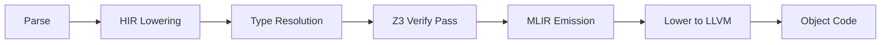

# Salt Language & Compiler Specification

> **Version**: 3.0 (June 2026)
> **Canonical Syntax Reference**: [SYNTAX.md](../SYNTAX.md)
> **Architecture Reference**: [ARCH.md](ARCH.md)

**Changes since 2.0**: Rewrote Section 2 to match the current Rust-based compiler
pipeline (the legacy C++ MLIR dialect backend is no longer active). Added
Stability Guarantees (Section 6). Updated Implementation Status (Section 5).
Marked aspirational features as experimental.

---

## 1. The Salt Language (User-Facing)

### 1.1 Core Paradigm
**Systems Programming with Formal Verification**

* **Immutability by default:** `let` for immutable bindings, `let mut` for mutable.
* **No Exceptions:** Errors are values (`Result<T>` with `Status`). Use `|?>` or `?` to propagate.
* **Explicit return:** Every function with a return type uses `return`. (Expression-statement tail returns also work but `return` is the canonical style.)

### 1.2 Syntax & Ergonomics

| Feature | Syntax | Rationale |
| :--- | :--- | :--- |
| **Mandatory Parens** | `print("hello")` | Removes parsing ambiguity. |
| **Pipeline** | `x \|> f()` | Sugar for `f(x)`. Enables "Reading Left-to-Right". |
| **Railway Pipe** | `x \|?> f()` | Sugar for `match x { Ok(v) -> f(v), Err(e) -> Err(e) }`. |
| **Contracts** | `requires(x > 0)` | Formal verification assertions proven by Z3. |

> **Full syntax reference**: types, control flow, traits, enums, pattern matching, sugar, and stdlib imports are maintained in [SYNTAX.md](../SYNTAX.md).

### 1.3 Memory Model
**Region-Based Allocation with Move Semantics**

* **No GC:** Memory is not traced.
* **Arena allocation:** The primary allocation strategy is `Arena`: scoped bump allocation with O(1) bulk free via `mark()`/`reset_to()`.
* **HeapAllocator:** For long-lived data that outlives a single scope, `HeapAllocator` wraps platform `malloc`/`free` behind a safe API.
* **Move Semantics:** Passing a value to a function *moves* it. The caller loses ownership. Use-after-move is a compile-time error.

### 1.4 Type System

- **ADTs**: `enum Shape { Circle(f32), Rect(f32, f32) }`
- **Exhaustive Matching**: `match` must handle every case
- **No Null**: Strict `Option<T>` and `Result<T>`
- **Traits**: `Clone`, `Eq`, `Hash`, `Ord` (derivable via `@derive`)
- **Generics**: Full monomorphization with multi-parameter support (`Vec<T, A>`)
- **Function Pointers**: `fn(u64, u64) -> u64` — first-class types for dispatch tables, IDT vectors, and indirect calls

### 1.5 Verification

```salt
fn safe_div(a: i32, b: i32) -> i32
    requires(b != 0)
    ensures(result * b == a)
{
    return a / b;
}
```

- **Contracts**: Native `requires(bool)` and `ensures(bool)`
- **Design by Contract**: Compiler proves safety *before* code runs via Z3
- **Zero-overhead verification**: Z3 proves contracts at compile time; proven conditions are fully elided. Unproven conditions emit standard MLIR runtime assertions (`scf.if` + panic)

---

## 2. Compiler Pipeline

The Salt compiler (`salt-front/`) is a Rust implementation that compiles Salt source
to MLIR (standard dialects), then to LLVM IR, then to native code.

### 2.1 Pipeline Phases

```
Source (.salt) → Preprocessor → Parser (syn-based) → HIR Lowering →
  Type Resolution → Z3 Verification → MLIR Emission → [Optional: SIR emission] →
    [mlir-opt → mlir-translate → llc → native binary]
```

| Phase | Responsibility |
|-------|---------------|
| **Preprocessor** | Converts Salt syntax to syn-compatible form. Handles `\|>`, `\|?>`, `@` matmul, f-strings, hex literals, `~` force-unwrap, `use`/`import` conversion, `@derive` expansion, module struct literals, C++-style generics. |
| **Parser** | Recursive-descent parser built on `syn`. Produces Salt AST (grammar types). |
| **HIR Lowering** | Lowers Salt AST to HIR (High Intermediate Representation) with type inference. |
| **Type Resolution** | Resolves types, monomorphizes generics, checks mutation and ownership. |
| **Z3 Verification** | Proves `requires`/`ensures` contracts and loop invariants. Falls back to runtime assertions on failure. |
| **MLIR Emission** | Generates standard MLIR ops: `func.func`, `func.call`, `arith.*`, `scf.*`, `llvm.*`, `cf.br`. |
| **SIR Emission** | (optional, `--emit-sir`) Exports Salt Intermediate Representation as JSON for tooling. |

### 2.2 Standard MLIR Dialects Used

- **`arith`**: Integer/float math (mapped to Z3)
- **`scf`**: Structured control flow (`if`, `for`, `while`)
- **`memref`**: Typed memory buffers
- **`func`**: Standard call/return
- **`llvm`**: Inline assembly (`llvm.inline_asm`), pointer ops

### 2.3 Bare Metal Bridge

- **Inline Assembly**: `salt.asm` grammar → `llvm.inline_asm`
- **Freestanding**: `-ffreestanding` for kernel/embedded targets (via `--target keuos`)

### 2.4 Verification Pipeline Detail



| Pass | Responsibility |
|------|----------------|
| **Z3 Verify** | Inter-procedural contract checking; loop invariant base-case + inductive-step |
| **Pulse Injection** | Inject yield checks at loop back-edges for `@pulse`/`@yielding` functions |
| **Yield Injection** | Cooperative scheduling yield points |
| **Binary Audit** | Post-link disassembly checks (KeuOS targets) |

---

## 3. Directory Structure

```text
keuos/
├── SYNTAX.md                    # Canonical syntax reference
├── docs/SPEC.md                 # This file (architecture & dialect spec)
├── docs/ARCH.md                 # Compiler pipeline & component reference
├── salt-front/                  # Rust Frontend (Parser, Typechecker, Z3, MLIR Emitter)
│   ├── src/grammar/             # Custom recursive-descent parser
│   ├── src/codegen/             # MLIR code generation (30+ modules)
│   └── std/                     # Standard library (70+ modules)
├── salt/                        # C++ Backend (Legacy — dialect definitions, no longer active)
│   ├── src/dialect/SaltOps.td   # Dialect Definition (archived)
│   └── src/passes/Z3Verify.cpp  # Original Z3 pass (superseded by Rust impl)
├── benchmarks/                  # Performance Harness
│   └── BENCHMARKS.md            # Official results and methodology
└── tests/                       # Integration tests
```

---

## 4. Example: End-to-End

**Source (`gauntlet.salt`)**:
```salt
fn safe_div(a: i32, b: i32) -> i32 requires(b != 0) { return 0; }
fn main() -> i32 { return safe_div(10, 0); }
```

**Generated MLIR** (when Z3 cannot prove the contract):
```mlir
module {
  func.func private @__salt_contract_violation()
  func.func @safe_div(%a: i32, %b: i32) -> i32 {
    %cond = arith.cmpi ne, %b, %c0 : i32
    %true = arith.constant true
    %violated = arith.xori %cond, %true : i1
    scf.if %violated {
      func.call @__salt_contract_violation() : () -> ()
      scf.yield
    }
    return %c0 : i32
  }
}
```

When Z3 **proves** the contract (e.g., the caller always passes a non-zero value), the `scf.if` block is **completely elided** — zero runtime cost. When Z3 **cannot prove** the contract (e.g., `safe_div(10, 0)`), the compiler emits the runtime assertion shown above, and separately reports:
```
WARNING: Could not formally prove contract. Emitting runtime check.
```

---

## 5. Implementation Status (June 2026)

| Feature | Status |
|---------|--------|
| `requires` precondition verification | ✅ Complete |
| `ensures` postcondition verification | ✅ Complete |
| Loop invariant verification (havoc & induction) | ✅ Complete |
| Contract runtime fallback (Z3 timeout / translation failure) | ✅ Complete |
| Debug overflow checks in contracts | ✅ Complete |
| Prelude auto-injection | ✅ Complete |
| Full ADT/`match` lowering | ✅ Complete |
| Trait resolution | ✅ Complete |
| Generic monomorphization | ✅ Complete |
| RAII-Lite (Automatic cleanup via Drop trait) | ✅ Complete |
| Vector intrinsics (SIMD) — `v_load`, `v_store`, `v_fma`, `v_hsum` | ✅ Complete |
| SSA Reduction (iter_args) | ✅ Complete |
| Function pointer types (`fn(T) -> R`) | ✅ Complete |
| SIR emission (`--emit-sir`) | ✅ Complete |
| Binary audit (post-link verification) | ✅ Complete |
| Pipeline operator (`\|>`), Railway (`\|?>`) | ✅ Complete |
| F-strings / hex literals / force-unwrap | ✅ Complete |
| `@matmul` operator | ✅ Complete |
| `@derive` annotation expansion | ✅ Complete |
| `@inline`, `@pure`, `@trusted`, `@export` attributes | ✅ Complete |
| `@yielding` / `@pulse` cooperative scheduling | ✅ Complete |
| `concept` keyword (type constraints) | ⚠ Experimental |
| LLVM JIT execution | 📋 Planned |
| `_` placeholder forwarding in method chains | ⚠ Experimental |
| Wasm32 target (z3-stub, no native Z3 link) | 📋 Planned |

---

## 6. Stability Guarantees

The following interfaces are **frozen** and should not change without a major
version bump and migration path:

### Frozen (Stable)

1. **Core syntax**: `fn`, `let`/`let mut`, `return`, `if`/`else`, `while`, `for`,
   `loop`, `match`, `struct`, `enum`, `impl`, `trait`, `package`, `import`
2. **Type system**: `i8`-`i64`, `u8`-`u64`, `f32`, `f64`, `bool`, `Ptr<T>`,
   `&T`/`&mut T`, `[T; N]`, `(T, U)`, `fn(T) -> R`, `String`, `StringView`
3. **Contracts**: `requires(expr)`, `ensures(expr)` grammar and Z3 verification
4. **Standard library paths**: `std.core.*`, `std.string.*`, `std.io.*`,
   `std.net.*`, `std.http.*`, `std.json.*`, `std.sync.*`, `std.channel.*`,
   `std.collections.*`, `std.process.*`, `std.thread.*`
5. **CLI flags**: `--release`, `--binary`, `-c`, `--target`, `--verify`,
   `--emit-sir`, `-g`/`--debug-info`, `--lib`, `--sip`, `-o`,
   `--skip-scan`, `--disable-alias-scopes`
6. **MLIR output**: The compiler emits standard MLIR dialects (`func`, `arith`,
   `scf`, `llvm`, `memref`, `cf`). No custom `salt` dialect ops are emitted.
7. **ABI**: Function call ABI (C ABI via extern), syscall ABI (see
   `docs/abi/KEUOS_ABI_STABLE.md`)

### Experimental (May Change)

1. **`_` placeholder forwarding**: Using `_` in method chains to forward the
   previous result (documented in SYNTAX.md). Not yet implemented.
2. **`concept` keyword**: Grammar and AST nodes exist; integration with type
   constraint checking is partial.
3. **LLVM JIT execution**: No implementation yet.
4. **Wasm32 target**: Backend stub exists but is not production-ready.
5. **`@pulse_budget` attribute**: Grammar and attr parsing done; scheduling
   backend integration is in progress.
6. **`async`/`await` (state machine lowering)**: The `async_to_state` pass
   exists but is not yet wired into the default pipeline.
7. **`std.autograd`**: Module exists but is in early development.

### Deprecated

1. **`--no-verify`**: Replaced by `--danger-no-verify`. Will be removed.
2. **Legacy C++ `salt/` backend**: Dialect definitions archived. The Rust
   frontend emits standard MLIR ops directly.

---

## 7. CLI Reference

```
Usage: salt-front <file.salt> [-o output] [--release] [--binary] [-c]
       [--target <target>] [--lib] [-g] [--emit-sir] [--skip-scan]
       [--verify] [--danger-no-verify] [--disable-alias-scopes]

Flags:
  --release            Enable optimizations
  --binary             Produce native Mach-O/ELF binary via Iron Driver
  -c                   Produce .o object file (like clang -c)
  --target T           Target: macos, linux-arm64, keuos, keuos-x86_64
  --verify             Run Z3 verification passes
  --skip-scan          Skip import scanning
  --lib                Library mode (no main entry point required)
  --sip                Mode B SIP safety enforcement
  -g / --debug-info    Emit DWARF debug info (MLIR loc annotations)
  --disable-alias-scopes  Suppress LLVM alias scope metadata
  --emit-sir           Emit SIR (Salt Intermediate Representation) as JSON
  --danger-no-verify   Skip ALL Z3/ownership verification (debug builds only)
  -o <path>            Output path (MLIR or binary)
```
