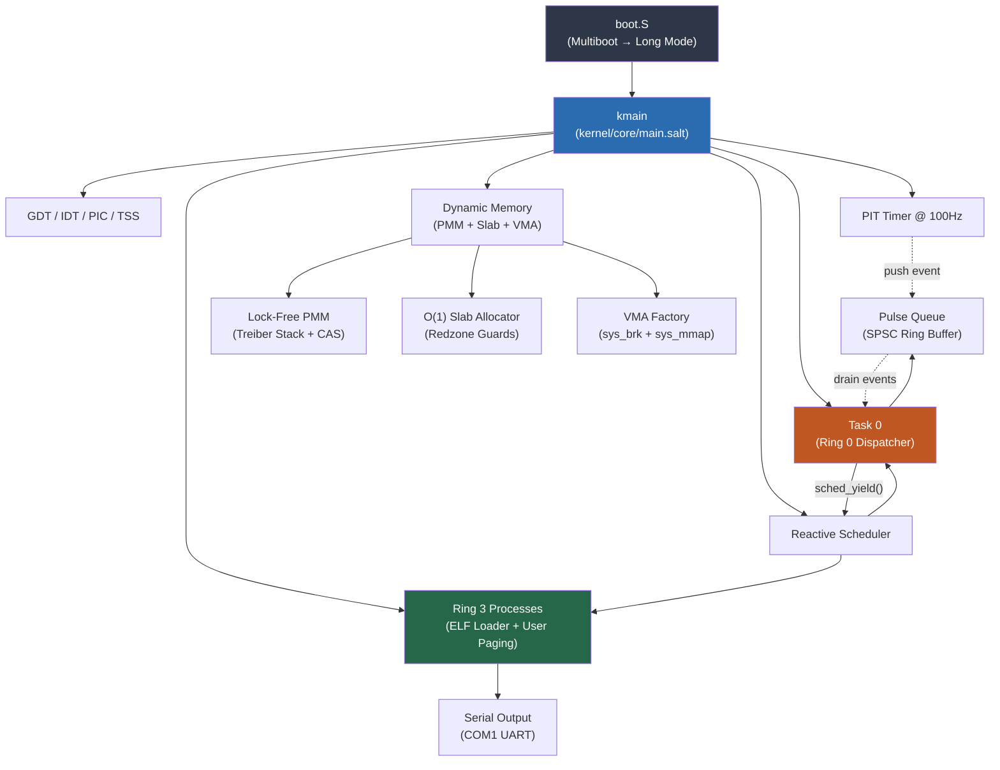

# Lattice Kernel

**The bare-metal heart of the Lattice operating system.** Written entirely in [Salt](../README.md), verified by Z3, running on x86_64 QEMU.

## Quick Start

```bash
# One command — builds compiler, compiles kernel, boots in QEMU
./scripts/demo_lattice.sh
```

**Prerequisites:** LLVM (`llc`, `clang`), Rust toolchain, QEMU (`qemu-system-x86_64`)

```bash
# macOS
brew install llvm qemu
# Ensure llc/clang are on PATH:
export PATH="/opt/homebrew/opt/llvm/bin:$PATH"
```

## Expected Output

```
Y12Z789!X
LATTICE BOOT: Serial OK
LATTICE BOOT: GDT...
LATTICE BOOT: IDT...
LATTICE BOOT: PIT...
LATTICE BOOT: Scheduler...
LATTICE BOOT: PMM...
LATTICE BOOT: Slab Cache...
LATTICE BOOT: VMA...

LATTICE KERNEL BOOT [OK]
[Lattice] PREEMPTIVE MODE
[Lattice] GDT/TSS Ring 3 ready
[spawn_kernel] Task 0 slot=0
[Lattice] Task 0 (dispatcher) spawned
[Lattice] SPAWNING PROCESSES
[Lattice] Switching to first process...
ALL TESTS PASSED: Memory subsystem verified
[Task 0] Dispatcher thread started
[B] Hello from Process B!
```

The `Y12Z789!X` prefix is diagnostic output from the bootloader confirming successful 32-bit → 64-bit Long Mode transition.

## Architecture



## Component Structure

| Directory | Role | Key Invariant |
|-----------|------|---------------|
| [`core/`](./core) | Scheduler, PMM, syscalls, dispatcher, process mgmt | **Memory Hoisting:** No dynamic allocation in critical paths |
| [`arch/`](./arch) | x86_64 boot, GDT/TSS, IDT, ISRs, SYSCALL fast path | **C-Parity:** Context switch matches C implementation |
| [`drivers/`](./drivers) | Serial (UART), VirtIO-Net | **Isolation:** Drivers cannot corrupt kernel state |
| [`mem/`](./mem) | Slab allocator, user paging, VMA, mm_layout | **O(1):** Bump allocation, zero free cost |
| [`net/`](./net) | Ethernet, IP, UDP, ARP | **Zero-copy:** Packet parsing without allocation |

## Verified Kernel Primitives

Salt's Z3 theorem prover verifies memory safety contracts **at compile time**:

```salt
// PMM: Callers must provide a valid memory range
pub fn init(start: u64, end: u64)
    requires(start < end)
{ ... }

// Region allocator: Zero-byte allocations are a compile error
pub fn alloc(size: u64) -> u64
    requires(size > 0)
{ ... }
```

These contracts are checked by Z3 at every call site — if any caller could violate the precondition, the code **does not compile**.

## Performance (KVM — Intel Xeon 8151, Feb 2026)

| Metric | Result | Notes |
|--------|--------|-------|
| **Arena Alloc** | 59 cycles (~15 ns) | Bump pointer, L1 cache resident |
| **PMM Alloc/Free** | 73 cycles (~18 ns) | Lock-free CAS (Treiber stack) |
| **IPC Ping-Pong** | 297 cycles (~74 ns) | Fiber-to-fiber zero-copy yield |
| **Context Switch** | 487 cycles (~122 ns) | Full GPR + 512B FXSAVE/FXRSTOR |
| **Slab Alloc** | O(1) | Treiber stack with `lock cmpxchgq` |

See [LATTICE_BENCHMARKS.md](../docs/LATTICE_BENCHMARKS.md) for full methodology.

## Build System

The kernel build uses `tools/runner_qemu.py`:

```bash
# Build only (compile all .salt + .S → kernel.elf)
python3 tools/runner_qemu.py build

# Build + boot in QEMU with benchmark
python3 tools/runner_qemu.py run
```

### Compilation Pipeline

```
kernel/**/*.salt  →  salt-front  →  MLIR  →  salt-opt  →  LLVM IR  →  llc  →  .o
kernel/**/*.S     →  clang       →  .o
                                     ↓
                              rust-lld  →  kernel.elf  →  QEMU
```

> [!IMPORTANT]
> **Zero-Panic Policy:** The kernel must never panic without diagnostic output. All panics print a status code and context message to serial before halting.
